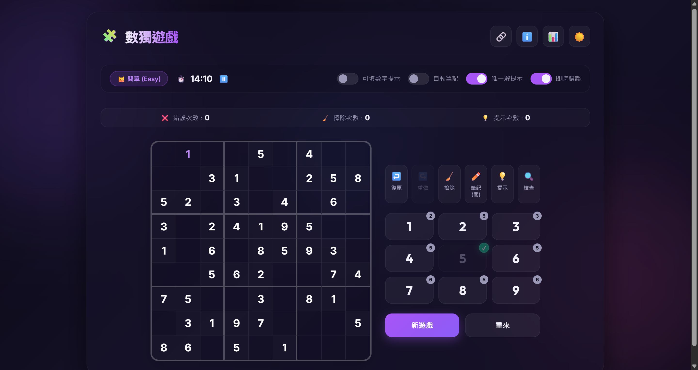

# 數獨遊戲 (Sudoku)

一個極致現代、美觀且極其流暢的網頁版數獨遊戲。

👉 **[立即線上遊玩！](https://flash2u.github.io/Sudoku/)**

## 🎮 遊戲畫面

## 📅 最後更新日期
- **最新版本**：v1.7
- **最後更新日期**：2026-07-02

## 🛠️ 技術棧 (Tech Stack)
本遊戲基於純前端技術開發，保證載入速度與極佳效能：
- **開發建置工具**：[Vite](https://vite.dev/) (高效能前端打包工具)
- **結構與邏輯**：HTML5 & Modern JavaScript (ES6+ 模組化編寫)
- **視覺美化**：Vanilla CSS3 (精美玻璃擬態設計、全響應式版面、滑順動畫與黑暗模式)
- **背景運算執行**：[Web Worker API](https://developer.mozilla.org/zh-TW/docs/Web/API/Web_Workers_API) (將數獨生成算法移出主執行緒，確保 60fps 畫面流暢無卡頓)
- **狀態持久化**：LocalStorage API (支援自動存檔、關卡復原及分難度詳細統計數據紀錄)

## ✨ 特色功能
- **分級背景生成**：提供「簡單」、「中等」、「困難」、「專家」四種難度，且具備專屬頭像（🧙‍♂️、🐯、🐶、🐱）。
- **唯一解保證**：生成器會通過自動解題器進行唯一解與邏輯可解性驗證，確保關卡不需要靠通靈或猜測。
- **可填數字提示**：右側數字鍵盤能根據選取格子的規則，淡出衝突數字，僅亮起合法候選數。
- **自動與手動筆記**：支援空格候選數一鍵填入與手動筆記模式。
- **一鍵檢查與分享**：點擊檢查會高亮錯誤格；點擊分享能自動生成帶有專屬 Puzzle 參數的網址複製到剪貼簿。
