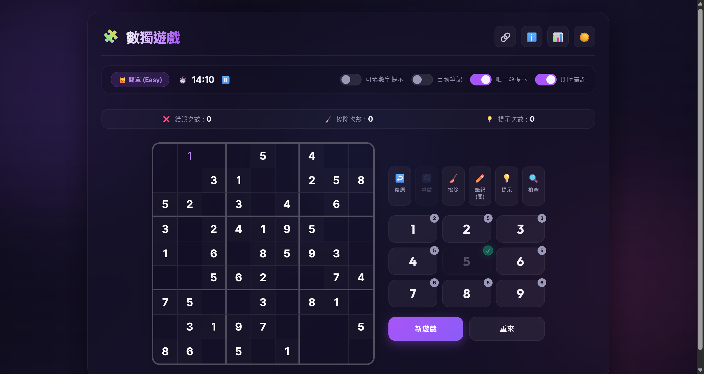

# 數獨遊戲 (Sudoku)

一個極致現代、美觀且極其流暢的網頁版數獨遊戲。

👉 **[立即線上遊玩！](https://flash2u.github.io/Sudoku/)**

## 🎮 遊戲畫面

## 📅 最後更新日期
- **最新版本**：v2.7
- **最後更新日期**：2026-09-21

## 🛠️ 技術棧 (Tech Stack)
本遊戲基於純前端技術開發，保證載入速度與極佳效能：
- **開發建置工具**：[Vite](https://vite.dev/) (高效能前端打包工具)
- **結構與邏輯**：HTML5 & Modern JavaScript (ES6+ 模組化編寫)
- **視覺美化**：Vanilla CSS3 (精美玻璃擬態設計、全響應式版面、滑順動畫與黑暗模式)
- **背景運算執行**：[Web Worker API](https://developer.mozilla.org/zh-TW/docs/Web/API/Web_Workers_API) (將數獨生成算法移出主執行緒，確保 60fps 畫面流暢無卡頓)
- **狀態持久化**：LocalStorage API (支援自動存檔、關卡復原、分難度詳細統計及本地勳章成就紀錄)

## ✨ 特色功能
- **分級背景生成**：提供「簡單」、「中等」、「困難」、「專家」四種難度，且具備專屬頭像（🧙‍♂️、🐯、🐶、🐱）。
- **唯一解保證**：生成器會通過自動解題器進行唯一解與邏輯可解性驗證，確保關卡不需要靠通靈或猜測。
- **本地勳章成就系統**：具備「🏆 數獨快手」、「🧠 純腦力運算」、「🎯 毫無破綻」、「📅 持之以恆」4 大榮耀挑戰，解鎖時伴隨頂部金色流光橫幅與專屬琶音慶祝，並設有「🏅 成就徽章牆」查看獲取進度與連續遊玩天數。
- **5 大個性化風格主題**：深邃暗夜（Dark）、晨曦明亮（Light）、OLED 極致純黑（OLED）、復古紙質（Vintage Paper）、森林抹茶（Matcha Green），頂部「🎨」選單隨心切換。
- **可填數字提示**：右側數字鍵盤能根據選取格子的規則，淡出衝突數字，僅亮起合法候選數。
- **自動與手動筆記**：支援空格候選數一鍵填入與手動筆記模式。
- **一鍵檢查與分享**：點擊檢查會高亮錯誤格；點擊分享能自動生成帶有專屬 Puzzle 參數的網址複製到剪貼簿。
- **原生鋼琴音階音效**：使用 Web Audio API 原生即時合成清脆鋼琴音階（1~9 數字鍵）、輕柔擦除回彈與溫和提示音，無需外部音檔依賴。
- **行列完成霓虹流光**：當湊齊任一整列、整行或九宮格時，即時觸發向上琶音和弦與極致炫彩階梯流光掃描動畫。
- **三段式智慧引導系統**：點擊提示不再直接剝奪思考樂趣！漸進式引導（1/3 範圍提示高亮 ➔ 2/3 邏輯推理排擠分析 ➔ 3/3 自動填入正解），自主推導成功不扣提示次數。
- **對角線 X-Sudoku 模式與主介面常駐開關**：支援「標準數獨」與「對角線 X-Sudoku」自由切換！主畫面控制區常駐「⚔️ 對角線 X 模式」專屬開關卡片，兩條主對角線（↘ 與 ↗）加入 1~9 不重複約束，具備醒目的紫晶透光斜紋、交會核放射發光、選取同儕高亮、獨立唯一解生成驗證、對角線完成流光掃描與智慧邏輯提示。
